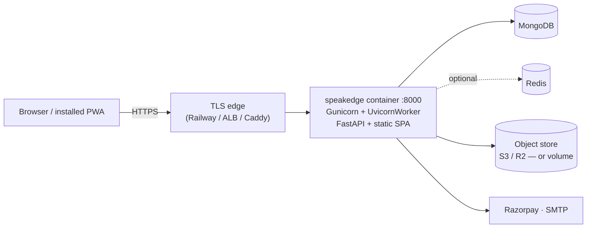
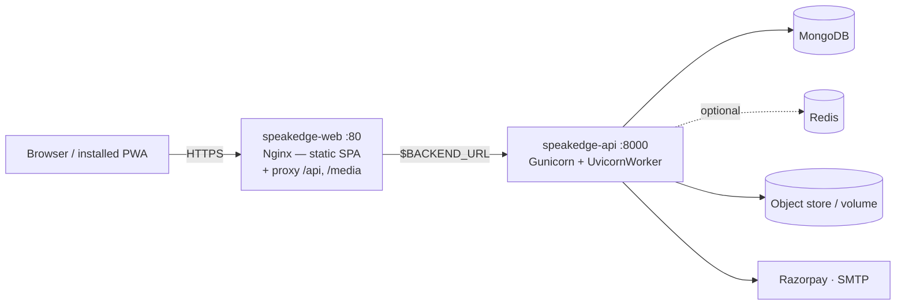
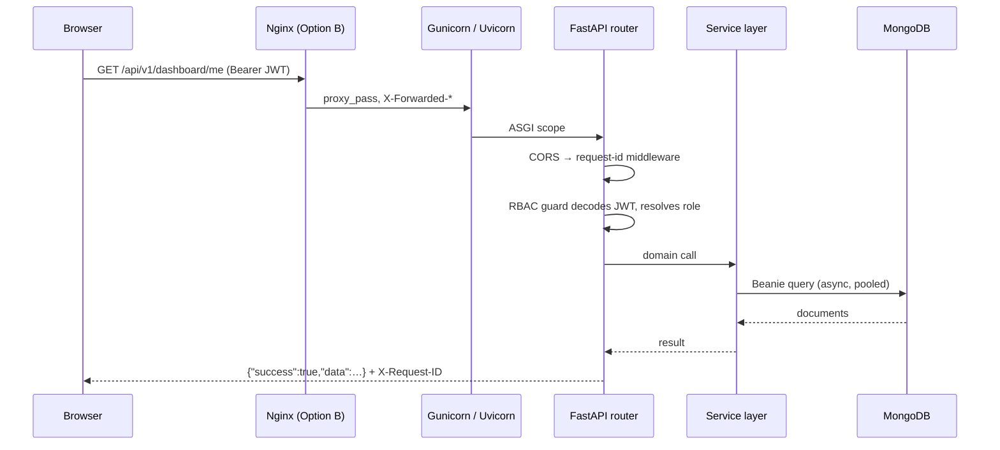
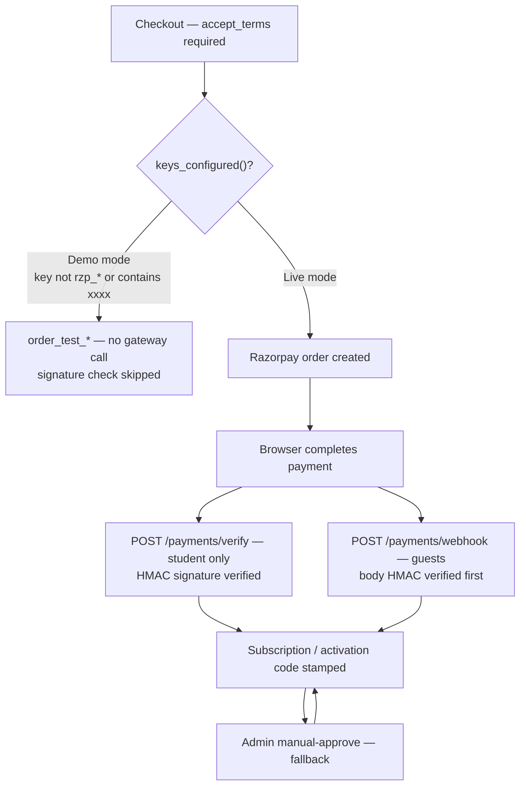
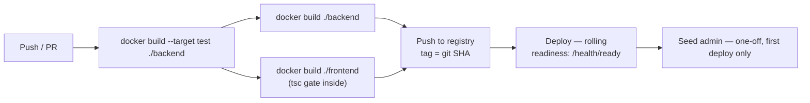

# SpeakEdge — Deployment & Architecture Handover

**Audience:** DevOps / CI-CD team
**Scope:** what the application is made of, how the pieces talk, and everything
needed to build, containerise, configure and operate it.

The earlier documents in this folder ([`02-Architecture.md`](02-Architecture.md),
[`03-Tech-Stack.md`](03-Tech-Stack.md), [`04-Infrastructure.md`](04-Infrastructure.md))
are **design-time** documents written before the build and describe a VM-based
topology. **This document describes the system as built and is the one to deploy
from.** Where the two disagree, this one wins.

---

## 1. What the system is

SpeakEdge is an **API-first modular monolith**, not a microservice fleet:

- **One backend process** — Python 3.12 / FastAPI, async top to bottom, split
  into 20 internal domain modules that all share one database and one deploy.
- **One frontend bundle** — React 18 + TypeScript, built by Vite, shipped as a
  static SPA/PWA.
- **One primary datastore** — MongoDB, accessed through Beanie (ODM over Motor).
- **Redis is optional** but becomes **mandatory above one worker** (§7).

There is no message broker, no separate job runner, and no service mesh. Scheduled
work runs **in-process** inside the API container — this is the single most
important operational constraint and it is covered in §7.

### Why it matters for CI/CD

| Property | Consequence for the pipeline |
|---|---|
| Stateless request path (JWT, no server sessions) | Any replica can serve any request; rolling deploys need no session draining. |
| Scheduler lives in-process | Exactly **one** instance may own scheduled jobs. Do not naively scale replicas. |
| SPA calls the API on **relative** paths | Frontend and backend must be same-origin, or the frontend must proxy. No `VITE_API_BASE` build arg exists. |
| Uploads written to local disk by default | Needs a persistent volume, or `STORAGE_BACKEND=s3`. Container filesystems are ephemeral. |
| Test suite uses an in-memory Mongo | CI can run the full suite with **no database service**. |

---

## 2. Component inventory

### 2.1 Backend — `backend/`

| Layer | Path | Responsibility |
|---|---|---|
| App factory | `app/main.py` | Registers all module routers under `/api/v1`, mounts `/media`, CORS, request-id middleware, lifespan (DB, cache, realtime hub, scheduler), optional SPA serving. |
| Core | `app/core/` | `config.py` (all settings, 12-factor), `security.py` (JWT + bcrypt + `Role`), `rbac.py` (guards), `envelope.py` (uniform response wrapper), `exceptions.py`, `cache.py`, `ratelimit.py`. |
| Data | `app/db/` | `models.py` — ~60 Beanie documents, the single source of truth for data shapes. `mongo.py` (pooled client + index build), `seed.py`. |
| Modules | `app/modules/<name>/` | One domain each: `router.py` (+ `service.py`). |
| Shared services | `app/shared/` | `scheduler.py` (APScheduler), `realtime.py` (WebSocket hub), `file_service.py` (local/S3), `pdf_service.py`, `email_service.py`, `audit.py`, `access.py`, `attendance.py`, `ai_client.py`. |

**Domain modules and their route prefixes** (all under `/api/v1`):

`auth` · `activation-codes` · `membership` · `dashboard` · `admin` · `payments` ·
`books` · `subscription` · `notifications` · `community` · `teacher` · `partner` ·
`exams` · `videos` · `leads` · `analytics` · `orientation` · `prompt-library` ·
`ai-session` · `instructions`

### 2.2 Frontend — `frontend/`

React 18 + TypeScript, Vite 5, Tailwind, TanStack Query, Zustand, React Router,
`vite-plugin-pwa` (injectManifest strategy, custom `src/sw.ts`).

- `src/app/App.tsx` — every route; layouts for public / student / admin.
- `src/features/<area>/` — page components.
- `src/lib/api.ts` — axios instance, envelope `unwrap<T>()`, **automatic token
  refresh on 401**.
- Build: `npm run build` == `tsc -b && vite build`. **A type error fails the
  build**, which is intentional — it makes the Docker image build a typecheck gate.

### 2.3 Roles

Six roles, carried in the JWT and enforced by dependency guards:
`super_admin` · `admin` · `examiner` · `teacher` · `partner` · `student`.
`super_admin` passes every guard; archive restore/purge is super-admin only.

---

## 3. Runtime topology

Two supported shapes. **Pick one** — they are alternatives, not layers.

### Option A — Single container (current default, used by Railway)

Built from the **repo-root** [`Dockerfile`](../Dockerfile). Node builds the SPA,
the artifact is copied into the Python image, and FastAPI serves it at `/` while
the API stays on `/api/v1`. One origin ⇒ **no CORS, no second host**.



### Option B — Split containers (frontend + backend)

Built from [`backend/Dockerfile`](../backend/Dockerfile) and
[`frontend/Dockerfile`](../frontend/Dockerfile). The SPA image is Nginx, which
serves the static bundle **and reverse-proxies `/api` and `/media`** to the API
container. This keeps the browser same-origin, so again no CORS and no rebuild
when the backend moves — only the `BACKEND_URL` env var changes.



> **Do not** deploy the SPA to a CDN/static host on its own domain. The client
> uses relative `/api/v1` and `/media` paths; a separate origin would require a
> code change plus `CORS_ORIGINS`. Option B's Nginx proxy exists precisely to
> avoid that.

### Ports and endpoints

| Container | Port | Endpoint | Purpose |
|---|---|---|---|
| api | 8000 (`$PORT`) | `GET /health` | **Liveness.** No dependency checks — always cheap. |
| api | 8000 | `GET /health/ready` | **Readiness.** Pings Mongo, reports cache backend. |
| api | 8000 | `/api/v1/*` | REST surface. |
| api | 8000 | `/media/*` | Uploaded files (only when `STORAGE_BACKEND=local`). |
| api | 8000 | `/docs`, `/redoc`, `/openapi.json` | OpenAPI. **Consider gating these in production.** |
| web | 80 | `GET /nginx-health` | Container health; does not touch the backend. |

Use `/health` for the liveness probe and `/health/ready` for the readiness probe.
Railway is already configured for `/health` in [`railway.json`](../railway.json).

---

## 4. Request flow



**Every response is wrapped** in an envelope by `core/envelope.py:ok()`, and the
frontend unwraps it in `lib/api.ts`. Errors are typed (`NotFoundError`,
`ConflictError`, `ValidationAppError`, `ForbiddenError`, `UnauthorizedError`) and
converted to consistent JSON by registered handlers. Two headers are added to
every response and are useful for log correlation:

- `X-Request-ID` — random per request.
- `X-Process-Time-ms` — server-side duration.

Logs go to **stdout/stderr** (Gunicorn `--access-logfile -`, `--error-logfile -`),
so any container log driver collects them with no extra config.

---

## 5. Key workflows

### 5.1 Authentication

JWT access (30 min) + refresh (30 days), HS256, signed with `SECRET_KEY`.
Stateless — **no server-side session store**, so replicas need no affinity.
Passwords are bcrypt via passlib. The frontend refreshes transparently on a 401.

> Rotating `SECRET_KEY` invalidates every issued token and logs everyone out.
> Treat it as a deploy-affecting secret, not a routine rotation.

### 5.2 Identity: activation code → membership

The book's **activation code becomes the permanent Student ID**. Admin generates
codes; a learner activates one via `POST /membership/activate` (multipart: form
fields + photo + ID proof), which creates the `Student`, copies the code's
`audience` (kids/adults course), and enters a verification queue.

### 5.3 Payments (Razorpay)



Two operationally important facts:

1. **Mode is inferred from the key**, not from a flag. A key id starting `rzp_`
   and free of `xxxx` switches on live behaviour: real orders, enforced
   signatures, and a gateway error now **raises** instead of silently falling
   back to a test order. A leftover placeholder key silently runs demo mode and
   would mark orders paid without money moving. **Verify the key in every
   environment.**
2. **Guest purchases reconcile only via the webhook.** Guests have no session, so
   they never hit the student-only `/payments/verify`. Register the webhook in
   the Razorpay dashboard → `POST https://<host>/api/v1/payments/webhook`, event
   `payment.captured`, signed with `RAZORPAY_WEBHOOK_SECRET`. If this is missed,
   guest book/membership orders sit unreconciled until an admin approves them by
   hand.

Terms acceptance is mandatory and stamped on the payment with
`settings.TERMS_VERSION` — bump it when policy pages change.

### 5.4 Realtime (WebSockets)

Three endpoints, all under `/api/v1` so any proxy rule covering `/api/` covers them:

- `/api/v1/community/ws/teams/{team_id}` — speaking-team chat
- `/api/v1/community/ws/dm/{student_id}` — direct messages
- `/api/v1/teacher/ws/batches/{batch_id}` — batch chat

They authenticate from a **query-string token** (browsers cannot set headers on a
WebSocket handshake). The proxy must therefore forward `Upgrade`/`Connection` and
allow long idle reads — the shipped
[`nginx.conf.template`](../frontend/nginx.conf.template) sets `proxy_read_timeout
3600s` and `proxy_buffering off`. Any load balancer in front needs a matching
idle timeout, otherwise chat sockets drop roughly every 60 seconds.

Fan-out is handled by `app/shared/realtime.py`: **Redis pub/sub when `REDIS_URL`
is set, in-process otherwise.** See §7.

### 5.5 Scheduled jobs (APScheduler, in-process)

Started by the FastAPI lifespan, i.e. **once per worker process**:

| Job | Interval | Purpose |
|---|---|---|
| `purge_expired_archives` | 6 h | Deletes soft-archived rows past 60-day retention. |
| `dispatch_scheduled_notifications` | 1 min | Sends notifications whose `scheduled_for` has passed. |
| `send_class_reminders` | 5 min | Upcoming-class nudges. |
| `send_attendance_reminders` | 5 min | Attendance nudges. |
| `send_attendance_confirmation_requests` | 15 min | Raises confirmations 24 h before class. |
| `expire_unconfirmed_attendance` | 15 min | Auto-cancels an unanswered seat 18 h later. |
| `credit_completed_batches` | 1 h | Teacher remuneration crediting. |
| `send_orientation_reminders` | 5 min | Live orientation session nudges. |
| `send_subscription_expiry_reminders` | 12 h | Nudges ~1 month before expiry. |
| `send_monthly_payment_reminders` | 12 h | Monthly fee due reminders. |

Jobs are written to be idempotent (dedup flags on the documents), so a duplicate
run is *usually* harmless — but it produces **duplicate notifications to real
users**, which is a support problem, not a data-integrity one. Do not rely on
idempotence as a licence to run multiple schedulers.

---

## 6. Build & CI/CD

### 6.1 Images

| Image | Context | Dockerfile | Base | Result |
|---|---|---|---|---|
| Single service | repo root | [`Dockerfile`](../Dockerfile) | `node:20-slim` → `python:3.12-slim` | API + SPA on :8000 |
| API only | `backend/` | [`backend/Dockerfile`](../backend/Dockerfile) | `python:3.12-slim` | API on :8000, non-root uid 10001 |
| SPA only | `frontend/` | [`frontend/Dockerfile`](../frontend/Dockerfile) | `node:20-slim` → `nginx:1.27-alpine` | SPA + proxy on :80 |

**Build contexts are not the repo root** for the split images:

```bash
docker build -t speakedge-api ./backend
docker build -t speakedge-web ./frontend
docker run -p 8080:80 -e BACKEND_URL=http://api:8000 speakedge-web
```

Each context has its own `.dockerignore` keeping `node_modules`, `.venv`,
`storage/`, and `.env` out of the build.

### 6.2 Test gate

The backend image has a dedicated **`test` stage**. The suite runs against an
in-memory MongoDB (`mongomock_motor`), so **CI needs no database service**:

```bash
docker build --target test ./backend      # fails the build on a red test
```

Test-only dependencies live in `backend/requirements-dev.txt` and are installed
**only** in that stage, so they never reach the runtime image. Locally:

```bash
cd backend
pip install -r requirements.txt -r requirements-dev.txt
python -m pytest -q
```

`tests/conftest.py` forces Razorpay demo mode, so a real key in a `.env` can
never make CI hit the payment gateway.

The frontend has no separate typecheck step to wire up — `npm run build` runs
`tsc -b` first, so building the image *is* the typecheck.

There is also a Playwright suite in [`e2e/`](../e2e/) that drives a running
stack; it is not part of the image build.

### 6.3 Suggested pipeline



Tag images with the git SHA rather than `latest`, so a rollback is a redeploy of
a known tag. Nothing in the app requires a build-time secret — the frontend has
**no** `VITE_*` variables baked in, so the same image is promotable across
environments unchanged.

### 6.4 First-deploy step

The super-admin and demo activation codes are created by a one-off seeder:

```bash
python -m app.db.seed     # inside the API container, once per environment
```

Change `SUPER_ADMIN_EMAIL` / `SUPER_ADMIN_PASSWORD` from their defaults **before**
seeding — the defaults are in the source.

Mongo indexes need no migration step: `init_beanie()` builds them on startup.
There is no migration framework in the project.

---

## 7. Scaling — read this before adding replicas

Two independent constraints, both stemming from the in-process design.

**(a) The scheduler must be a singleton.** Its `lifespan` hook runs once per
worker *and* per replica. Two workers ⇒ every reminder sent twice. This is why
`WORKERS` defaults to `1` in all three images.

**(b) WebSocket fan-out needs Redis above one process.** Without `REDIS_URL`,
`realtime.py` falls back to in-process fan-out, so a socket on worker A never
receives a message published on worker B — chat silently half-works.

| Target | Configuration |
|---|---|
| Single instance, low traffic | `WORKERS=1`, no Redis. Correct as-is. |
| More request throughput | Set `REDIS_URL`, raise `WORKERS` **only after** the scheduler is isolated to one leader process. |
| Multiple replicas | `REDIS_URL` **required**. Exactly one replica may run the scheduler. |

The scheduler is not currently gated by a flag or a distributed lock — isolating
it is a **code change** (an env-driven `RUN_SCHEDULER` guard plus a dedicated
single-replica worker deployment is the smallest version). Until that lands,
treat **one instance × one worker** as the safe production ceiling for the
scheduler, and scale by adding capacity to that instance.

Everything else scales cleanly: auth is stateless, Motor pools 100 connections,
and the request path is async end to end.

---

## 8. Configuration reference

All settings are environment variables read by `app/core/config.py` (pydantic
`BaseSettings`, also reads a `.env`). Every one has a default, so the app boots
with none set — which is exactly why the security-relevant ones must be set
explicitly in production.

### Required in production

| Variable | Notes |
|---|---|
| `MONGO_URI` | Connection string. |
| `MONGO_DB` | e.g. `speakedge`. |
| `SECRET_KEY` | JWT signing key. Generate: `python -c "import secrets;print(secrets.token_urlsafe(48))"`. **The default is a placeholder committed to the repo.** |
| `SUPER_ADMIN_EMAIL` / `SUPER_ADMIN_PASSWORD` | Change before seeding. |
| `ENV` | `production`. |
| `DEBUG` | `false`. |

### Payments, email, storage

| Variable | Default | Notes |
|---|---|---|
| `RAZORPAY_KEY_ID` / `RAZORPAY_KEY_SECRET` | placeholder | A real `rzp_…` id switches off demo mode. See §5.3. |
| `RAZORPAY_WEBHOOK_SECRET` | placeholder | Required for guest order reconciliation. |
| `STORAGE_BACKEND` | `local` | `local` \| `s3`. |
| `UPLOAD_DIR` | `/app/storage/uploads` | Mount a volume at `/app/storage` when `local`. |
| `S3_ENDPOINT` / `S3_BUCKET` / `S3_ACCESS_KEY` / `S3_SECRET_KEY` / `S3_REGION` | — | S3 or Cloudflare R2. Recommended over a volume. |
| `SMTP_HOST` / `SMTP_PORT` / `SMTP_USER` / `SMTP_PASSWORD` / `SMTP_FROM` / `SMTP_TLS` | Mailhog-ish local defaults | Email is best-effort; failures are logged, not fatal. |
| `MAX_PHOTO_KB` / `MAX_ID_PROOF_KB` / `MAX_VIDEO_MB` / `MAX_PDF_MB` | 120 / 500 / 200 / 25 | Nginx `client_max_body_size` is set to 220m to clear the video cap. |

### Infrastructure & behaviour

| Variable | Default | Notes |
|---|---|---|
| `PORT` | 8000 | Railway injects this — do **not** set it there. |
| `WORKERS` | 1 | See §7 before raising. |
| `REDIS_URL` | *(empty)* | Cache, rate limiting, WebSocket fan-out. Required above one process. |
| `CORS_ORIGINS` | localhost dev origins | JSON array. **Only needed if you break same-origin**, which is not the recommended topology. |
| `ACCESS_TOKEN_EXPIRE_MINUTES` / `REFRESH_TOKEN_EXPIRE_DAYS` | 30 / 30 | |
| `RATE_LIMIT_AUTH_PER_MIN` / `RATE_LIMIT_PAYMENT_PER_MIN` | 20 / 30 | Per-process counters when Redis is absent. |
| `ARCHIVE_RETENTION_DAYS` | 60 | Purge horizon. |
| `TERMS_VERSION` | `2026-08` | Stamped on payments. |
| `AI_PROVIDER` | `stub` | Deterministic offline responder — no API key, no network. |
| `VAPID_PUBLIC_KEY` / `VAPID_PRIVATE_KEY` / `VAPID_CONTACT` | *(empty)* | Web push; disabled while empty. |
| `SMS_PROVIDER` / `WHATSAPP_PROVIDER` | *(empty)* | Log-only stubs while empty. |

**Frontend:** `BACKEND_URL` (Option B only, default `http://backend:8000`) is
substituted into the Nginx config at container start. There are no build-time
frontend variables.

---

## 9. External dependencies

| Dependency | Required? | Failure behaviour |
|---|---|---|
| MongoDB | **Yes** | App cannot start meaningfully; `/health/ready` reports `db: false`. |
| Redis | Only above one process | Transparent in-memory fallback; correct for a single worker only. |
| Razorpay | For real payments | Placeholder keys ⇒ demo mode, orders marked paid without money moving. |
| SMTP | For email | Best-effort; logged on failure. |
| S3 / R2 | If `STORAGE_BACKEND=s3` | Otherwise local disk is used. |
| AI provider | No | `stub` by default; the whole learning engine runs offline. |

No outbound dependency is on the request-serving critical path except MongoDB.

---

## 10. Operational checklist

Pre-deploy:

- [ ] `SECRET_KEY` set to a generated value (not the committed default).
- [ ] `SUPER_ADMIN_PASSWORD` changed, then seeder run once.
- [ ] Razorpay key verified as live, **and** the webhook registered in the
      Razorpay dashboard pointing at `/api/v1/payments/webhook`.
- [ ] Persistent volume mounted at `/app/storage`, **or** `STORAGE_BACKEND=s3`
      configured. Uploads are otherwise lost on every redeploy.
- [ ] `WORKERS=1` unless the scheduler has been isolated (§7).
- [ ] `REDIS_URL` set if more than one process/replica will run.
- [ ] TLS terminated in front of the container; both images expect to sit behind
      a TLS edge and neither terminates TLS itself.
- [ ] Load-balancer idle timeout ≥ the WebSocket read timeout.
- [ ] Liveness `/health`, readiness `/health/ready`.
- [ ] Decide whether `/docs` and `/openapi.json` should be public.

Backups: MongoDB is the only stateful store besides uploaded media. Back up both.

---

## 11. Known gaps

Stated plainly so they are not discovered in production:

1. **The scheduler cannot be scaled out** without a code change (§7). This caps
   the safe deployment at one scheduler-owning process.
2. **No database migration framework.** Schema evolution currently relies on
   Beanie's tolerance of missing fields plus defaults on the models. Fine so far;
   worth planning before the first breaking model change.
3. **No CSP header.** [`nginx.conf.template`](../frontend/nginx.conf.template)
   sets `X-Content-Type-Options`, `X-Frame-Options` and `Referrer-Policy` but
   deliberately omits Content-Security-Policy until asset origins settle.
4. **`/docs` and `/redoc` are unauthenticated** in every environment.
5. **Rate limits are per-process** without Redis, so the effective limit
   multiplies by the worker count.
