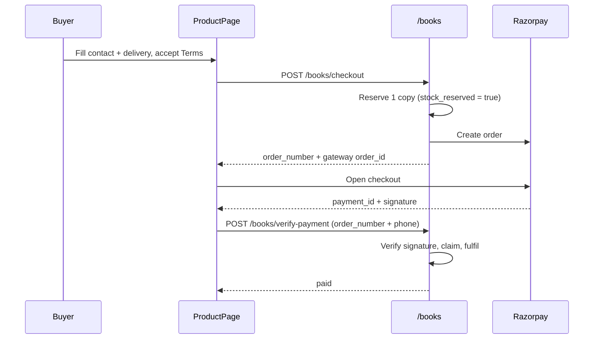

# Payments, Purchases & Fulfilment

How money enters SpeakEdge, what each purchase produces, and the invariants that
keep it correct. Two things can be bought:

1. **A book** from the shop (Sujyoti Publications titles) — a physical order.
2. **A membership** — either bundled with the SpeakEdge Book (new joiners) or on
   its own (existing members renewing/upgrading).

Everything runs through Razorpay. There is no recurring-billing engine: the
monthly fee is a *derived schedule* the student pays one month at a time
(see [Monthly fees](#monthly-fees)).

---

## Ground rules

These hold across every path. Breaking one is a bug, not a design choice.

| Rule | Where it lives |
|---|---|
| **The client never prices anything.** Requests carry a plan key, never an amount. `POST /payments/order` ignores `amount`/`kind` if sent. | `payments/service.create_order`, `_price_for` |
| **No payment starts without accepting the Terms.** `accept_terms: true` is required and stamped on the `Payment` with `settings.TERMS_VERSION`. | `payments/router.py`, `book/router.py` |
| **Fulfilment happens exactly once per order.** A conditional update claims the payment; only the winner creates the subscription, invoice and activation code. | `payments/service._claim_for_fulfilment` |
| **Signatures are verified server-side.** Only the webhook skips the per-order signature, and only after its body HMAC passes. | `_verify_signature`, `verify_webhook_signature` |
| **The webhook fails closed.** An unset or placeholder `RAZORPAY_WEBHOOK_SECRET` rejects every webhook. | `webhook_configured()` |
| **Refunds call the gateway before they are recorded.** | `payments/service.refund_payment` |
| **Amounts are in paise, everywhere.** `₹499` is `49900`. | all models |

---

## Flow 1 — Book purchase

A plain title from the shop. No membership, no activation code.



**After payment** (`book/service.on_book_order_paid`):

- Status → `Order Confirmed` → `Inventory Reserved`
- Office pickup → OTP + QR token issued, status `Ready for Pickup`
- Home delivery → status `Ready for Dispatch`
- SMS + WhatsApp confirmation to the buyer
- **No activation code is reserved** — only membership orders consume one

**Admin fulfilment**: `/admin/books` → assign courier + tracking →
`Shipped` (decrements physical stock) → `Delivered`. Office orders are closed by
verifying the OTP or QR at `POST /books/admin/pickup/verify`.

### Stock

Reserved at **checkout**, not at payment, so two buyers cannot both pay for the
last copy — the second checkout returns `409`. `BookOrder.stock_reserved` is the
single flag every release path checks (ship, collect, cancel, expiry).

The cost of holding stock early is abandoned carts, so
`book/service.expire_abandoned_orders` runs every 30 minutes and cancels unpaid
orders older than `ORDER_PAYMENT_WINDOW_HOURS` (default 48), releasing the copy.
It re-checks the payment first, so a webhook still in flight cannot lose a sale.

### Abandoned payments

An order whose buyer closed the gateway stays at `Payment Pending` and is
recoverable: `POST /books/resume-payment {order_number, phone}` issues a **new**
gateway order against the same `BookOrder`/`Payment` (a Razorpay order id is
good for one attempt only, so the original cannot be reopened). Surfaced as
**Pay now** on `/track`.

---

## Flow 2 — Membership purchase

Two entry points, decided by whether the buyer is signed in.

### 2a. Guest — membership + SpeakEdge Book (one order, one payment)

`/plans` → Subscribe → `/checkout?plan=` → `POST /books/checkout` with a `plan`.

Exactly one `BookProduct` carries `is_speakedge_book`. That book can only be
bought with a plan, and a plan bought by a guest comes with that book. The
`Payment` stays `kind="book"`, so **no `Subscription` is created at payment** —
the plan is stamped on a reserved `ActivationCode` (`plan`, `plan_months`), and
`membership/service._start_paid_subscription` turns it into the first
`Subscription` when the buyer activates.

```
Payment captured
  └─ reserve activation code (plan + months stamped on it)
  └─ order → Ready for Dispatch / Ready for Pickup
       └─ book delivered or collected
            └─ order → Membership Activation Pending
                 └─ /activate?code=…  →  Student + Subscription created
```

The confirmation screen shows the activation code immediately (fulfilment is
synchronous) and links straight to `/activate?code=`, which prefills the field.
It is also on `/track` with the buyer's phone.

**Membership-only fallback.** When no SpeakEdge Book is configured *or* it is out
of stock, `/checkout` sells the membership alone rather than dead-ending:
`book_amount = 0`, no delivery charge, no GST, address kept as a billing record,
and the order goes straight to `Membership Activation Pending`. An inventory
problem never blocks new memberships.

### 2b. Signed-in member

`/plans` → Subscribe → `/checkout/membership` → `POST /payments/order`.

Same bundle as the guest route: `delivery_type` (`home`/`office`) puts a copy of
the SpeakEdge Book on the order via `_book_quote`, and
`book/service.create_membership_shipment` files the `BookOrder` against the
subscription payment. With no book configured, one out of stock, or no
`delivery_type` sent, nothing ships and the address is a plain **billing** record
(`Payment.billing`), copied onto the `Student` profile by
`_save_billing_to_profile`. The `Subscription` is created during
`/payments/verify`, so the member is active the moment payment confirms and is
sent to their dashboard.

### Pricing

`_price_for` charges the **one-time admission/membership fee** — `offer_price` if
set, else `amount`. `monthly_fee` is *quoted* on the plan card and collected
separately; it is never folded into the upfront charge. `PlanConfig.prices`
(`{months → paise}`) is an optional admin override and seeds empty.

`months` sets subscription **validity only**, never price.

**The SpeakEdge Book is included in the membership fee.** A membership order —
the guest bundle or a member's own — ships the copy but never adds a book charge
or GST on one (`book_amount = 0`, `gst_amount = 0` in both `_book_quote` and
`book/service.create_checkout`), and the receipt prints the book line as
*Included*. Delivery is a real cost and is unaffected: home delivery still
charges `BOOK_DELIVERY_CHARGE_PAISE`, office pickup is free. A book bought on its
own from the shop is priced from the catalogue as usual.

### Membership upgrade

**Price = standard price of the new tier − standard price of the tier held.**
"Standard" is the catalogue `amount`, so a discount the learner once received —
an admission-offer link, a promotional `offer_price` — never changes what an
upgrade costs, in either direction (`service.upgrade_quote`). Moving to a
cheaper tier or renewing the same one is not an upgrade and gets no credit,
otherwise a renewal would cost ₹0.

An upgrade is **membership only**: no second SpeakEdge Book, no delivery, no
first-month fee (`create_order` forces those off), and the receipt shows fee →
credit → paid from `Payment.previous_plan` / `upgrade_adjustment`.

**Activation date.** The learner picks when the upgraded membership takes over —
any date up to `service.UPGRADE_ACTIVATION_DAYS` (30) after paying, sent as
`activate_on` ("YYYY-MM-DD"); today, or nothing at all, means immediately. The
checkout page shows the *Important Upgrade Notice* above the Pay button before
the money moves. A dated upgrade is **parked on the membership already held**
(`Subscription.pending_plan` / `pending_plan_at` / `pending_payment_id`) and that
membership runs untouched until the day; the scheduler job `apply_plan_changes`
(hourly) switches it over.

**Benefits carry forward — they never restart.** `service.switch_plan(carry=…)`
copies `benefits_start_at` (the *first* membership start) onto the new
subscription and counts the new tier's validity from it, so a Basic member six
months in who moves to Diamond has 4 years 6 months of the 5-year community
access left, not 5 fresh years. Counted entitlements need no arithmetic: exam
eligibility is the new tier's total and `exams._eligibility` deducts every test
ever booked. `billing_start_at` and `monthly_reminders_sent` carry too, so a
change never re-anchors the monthly cycle or re-sends a reminder. A **renewal**
passes no `carry` and so does start a fresh window.

### Membership downgrade

Only the three Pro tiers, and only to their own standard tier —
`service.DOWNGRADE_PATHS`: Silver Pro → Silver, Gold Pro → Gold, Diamond Pro →
Diamond. The difference is the teacher-led classes per week (2 → 1).

It is free, so there is no payment and no activation-date choice: it takes effect
from the learner's **next monthly payment cycle** (`_next_cycle_date`, the next
date in the derived monthly schedule), and the Pro benefits run to the end of the
cycle already paid for. Consumed benefits carry across exactly as on an upgrade.

| Endpoint | Who |
|---|---|
| `GET /payments/plan-change` | student — the change scheduled, and the downgrade on offer |
| `POST /payments/downgrade` | student — schedule Pro → standard |
| `DELETE /payments/plan-change` | student — call off a scheduled downgrade |

A downgrade can be cancelled while it is pending; a **paid upgrade cannot** —
that is a refund, so it 409s and points at support. `PlanChangePanel` on
`/dashboard/subscription` renders whichever of the two applies.

### New Student Offer (temporary discounted admission)

A prospect who has not taken admission yet can be sent a **time-limited payment
link** that discounts the admission fee for them alone.

Admin creates it at **Offers → New student offers**: membership plan, offer
price, and a link validity of **24 / 48 / 72 hours** (`service.OFFER_VALID_HOURS`
— nothing else is accepted, and the price must be below the plan's catalogue
admission fee). The row carries copy / WhatsApp / email shortcuts so admin sends
the link themselves; the system does not message anyone.

| Endpoint | Who |
|---|---|
| `POST /payments/admin/admission-offers` | admin — mint a link |
| `GET /payments/admin/admission-offers` | admin — every link ever minted, expired included |
| `DELETE /payments/admin/admission-offers/{id}` | admin — revoke early (archives it) |
| `GET /payments/admission-offers/{token}` | public — what the link is worth right now |

The link is `/offer/<token>`. `OfferLinkPage` resolves it and forwards to
`/checkout?plan=…&offer=<token>`; **expired, revoked and unknown tokens are all a
404** and send the visitor to `/plans` at the regular prices, which is the whole
of the "after expiry" behaviour.

Pricing is server-side as everywhere else: `POST /books/checkout` takes the
token, `service.offer_admission_price` re-checks it, and the offer price replaces
the **admission fee only** — the first month, the SpeakEdge Book, GST and
delivery are untouched. An offer used against a different plan, or after it
lapsed, **raises** rather than silently reverting to the full fee: the buyer came
in on an offer, so charging them more without saying so is the one outcome that
must not happen quietly. A signed-in member with an active subscription is
refused — these are for new joiners.

`BookOrder.offer_token` records the link an order was bought on, and
`record_offer_use` counts the purchase against it when payment lands, so admin
can see whether a link converted. The link is not tied to the named recipient:
whoever holds it can buy at that price until it expires — revoke it to kill it
early.

---

## Gateway integration

### Two modes

`payments/service.keys_configured()` decides, by whether `RAZORPAY_KEY_ID`
starts with `rzp_` and contains no `xxxx`.

- **Demo** (placeholder keys): no gateway call, order ids are `order_test_*`,
  verification skips the signature. The frontend mirrors the rule (`isDemoOrder`)
  and self-verifies, so the whole journey is demoable offline. `tests/conftest.py`
  forces this so a real key in `.env` never makes the suite hit the network.
- **Live**: real orders with `payment_capture: 1`. A gateway error **raises** — it
  must never fall back to a test order id, which downstream treats as pre-paid.

### Confirmation paths

| Path | Who | Notes |
|---|---|---|
| `POST /payments/verify` | signed-in student | Scoped to the caller's own order |
| `POST /books/verify-payment` | guest | Matched on order number + phone |
| `POST /payments/webhook` | Razorpay | Body HMAC checked; backstop reconciler |
| `POST /payments/manual-approve` | admin | Cash / bank transfer / UPI taken offline |

All four converge on `verify_and_activate` → `_claim_for_fulfilment` → `_fulfil`.
Razorpay fires `payment.captured` and `order.paid` while the browser is posting
its own verify, so the claim is what stops one order producing two invoices and
two active subscriptions.

### Webhook events to subscribe

| Event | Effect |
|---|---|
| `payment.captured` | Fulfil the order |
| `order.paid` | Fulfil the order (same claim; duplicate is a no-op) |
| `payment.failed` | Mark the attempt `failed`; never touches a paid record |
| `refund.created` / `refund.processed` | Reconcile a refund issued from the dashboard |

Endpoint: `POST /api/v1/payments/webhook`.

### Refunds

`refund_payment` posts to Razorpay **first** and records only on success; a
gateway error raises with a message telling the admin to retry or refund from the
dashboard. Payments taken outside the gateway (manual approval, demo orders) have
nothing to call and are recorded as settled by hand.

`POST /payments/{order_id}/refund-status` drives the lifecycle:

```
Refund Requested → Refund Under Review → Refund Approved/Rejected
                                            └→ Refunded | Partially Refunded
```

Only the last two move money. A partial refund must carry `amount` (paise) —
it is refused rather than guessed. `POST /books/admin/orders/{id}/cancel` with
`refund: true` uses the same path, and also releases the reserved copy and the
activation code.

---

## Invoices

Generated in `_fulfil`, stored on `Payment.invoice_no` / `invoice_url`, and
downloadable by the student from `/dashboard/payments`.

A **tax breakup is printed only once `SELLER_GSTIN` is set**: `_apply_gst` fills
`taxable_amount`, `cgst`/`sgst` (buyer's state matches `SELLER_STATE`) or `igst`,
and the document is titled *TAX INVOICE*. Without a GSTIN it stays *INVOICE* and
states the price is tax-inclusive — printing a breakup without a registration
would be a false tax invoice.

Guest invoices show the buyer's phone, never the internal `guest:<phone>` key.

Separately, `GET /books/receipt/{order_number}?phone=` renders an order receipt
on demand, so it works before payment is reconciled.

---

## Monthly fees

There is no billing engine — only a derived schedule (`payments/monthly.py`).

- Due dates = `Subscription.billing_start_at` (the student's first teacher-led
  class, set by admin) + n calendar months, falling back to `started_at`.
- A month is settled by a paid `Payment(kind="monthly", due_month="YYYY-MM")`.
- `GET /payments/monthly-due` returns the next unsettled month; overdue months
  keep coming back.
- `MonthlyDuePopup` (in `StudentLayout`) collapses to a persistent bar and is
  never fully dismissible until paid.
- Scheduler job `send_monthly_payment_reminders` raises one notification per due
  month, deduped via `Subscription.monthly_reminders_sent`.

Terms acceptance is inherited from the original purchase rather than asked again.

---

## Testing

### Test cards (Razorpay test mode)

| Field | Value |
|---|---|
| Card | `4111 1111 1111 1111` (Visa) |
| Alt card | `5267 3181 8797 5449` (Mastercard) |
| Expiry | any future date |
| CVV | any 3 digits |
| OTP / 3DS | simulator page — click **Success** or **Failure** |

- **UPI**: `success@razorpay` / `failure@razorpay`
- **Netbanking / wallets**: any option, then Success/Failure on the simulator

Use the simulator's Failure button to exercise the declined path rather than a
decline-specific card number. The current list is at
`razorpay.com/docs/payments/payments/test-card-details/`.

### Testing webhooks locally

Webhooks need a public URL and a real secret:

```bash
ngrok http 8000
# Razorpay dashboard → Webhooks → https://<tunnel>/api/v1/payments/webhook
# paste the secret into RAZORPAY_WEBHOOK_SECRET
```

Until `RAZORPAY_WEBHOOK_SECRET` is a real value, every webhook is rejected by
design and the browser-side verify does all the reconciling.

### Automated

```bash
cd backend; ./.venv/Scripts/python.exe -m pytest -q
```

`tests/test_payment_gateway.py` covers the trust boundaries (who may confirm a
payment, what a webhook must prove, what the client may price, concurrent
fulfilment, refunds). `tests/test_membership_book_bundle.py` covers both purchase
journeys end to end.

---

## Configuration

| Setting | Default | Notes |
|---|---|---|
| `RAZORPAY_KEY_ID` | `rzp_test_xxxxxxxx` | Placeholder keeps demo mode alive |
| `RAZORPAY_KEY_SECRET` | `test_secret` | |
| `RAZORPAY_WEBHOOK_SECRET` | `webhook_secret` | Placeholder ⇒ webhooks rejected |
| `TERMS_VERSION` | `2026-08` | Bump when policy pages are revised |
| `BOOK_DELIVERY_CHARGE_PAISE` | `10000` | Home delivery only |
| `PICKUP_EXPIRY_DAYS` | `14` | Office-collection token validity |
| `ORDER_PAYMENT_WINDOW_HOURS` | `48` | Unpaid orders cancelled after this |
| `SELLER_GSTIN` | `""` | Empty ⇒ no tax breakup on invoices |
| `SELLER_STATE` | `West Bengal` | Place of supply: CGST/SGST vs IGST |

---

## Go-live checklist

- [ ] Live `RAZORPAY_KEY_ID` / `RAZORPAY_KEY_SECRET` set
- [ ] Real `RAZORPAY_WEBHOOK_SECRET` set — otherwise the backstop reconciler is off
- [ ] Webhook subscribed to `payment.captured`, `order.paid`, `payment.failed`,
      `refund.created`, `refund.processed`
- [ ] `SELLER_GSTIN` + `SELLER_STATE` set if invoices must carry a tax breakup
- [ ] `TERMS_VERSION` matches the published policy pages
- [ ] Legal review of `/terms`, `/privacy`, `/refund-policy` (drafted from how the
      platform works; not yet reviewed)
- [ ] Activation-code pool stocked — `_reserve_activation_code` returns `None`
      when exhausted and the order needs a manual code
- [ ] One `BookProduct` flagged `is_speakedge_book`, with stock
- [ ] Scheduler running (order expiry, monthly reminders, subscription expiry)
